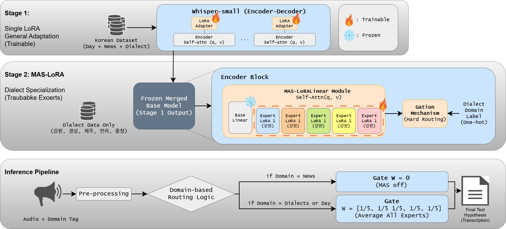

# Robust-Korean-Whisper-Multi-domain

이 레포지토리는 **Whisper-small** 기반 한국어 ASR에 대해

- **Stage 1:** 일반 도메인용 단일 LoRA 파인튜닝  
- **Stage 2:** 방언 전용 **Encoder-only MAS-LoRA (5 experts)** 전이학습  
- **전처리 · 정규화 · 평가 파이프라인**

을 모두 포함한 실험 코드이다.

---

## 1. 전체 아키텍처 개요

Stage 1에서 학습된 LoRA를 Whisper-small에 merge하여 **공통 베이스 모델**을 만든 후,  
Stage 2에서 Encoder self-attention(q, v projection)에만 **5개의 expert MAS-LoRA**를 추가로 학습한다.

```text
[Stage 1] Whisper-small + Single LoRA
  └─ 다양한 도메인(일반/뉴스/전화 등)으로 단일 LoRA 파인튜닝
  └─ 최종적으로 Whisper weight에 LoRA를 merge (공통 베이스)

[Stage 2] Dialect MAS-LoRA (Encoder-only)
  └─ Stage 1에서 merge된 Whisper-small+LoRA 전체를 freeze
  └─ Encoder self-attn q_proj / v_proj → MAS-LoRALinear 로 교체
       · base: Stage1 merge Linear (고정)
       · experts: 5개 dialect expert LoRA (trainable)
  └─ 각 방언(<Dia><JL>, <GW>, <GS>, <JJ>, <CC>)은 자기 expert만 1인 one-hot gate로 학습
  └─ 검증(inference proxy)에서는 5개 expert를 1/5 균등 mixture로 사용
```

모델 구조도는 다음과 같다.





---

## 2. 디렉토리 구조

코드는 크게 `train`, `test`, `preprocessing`, `normalization` 폴더로 구성된다.

```text
.
├── train/
│   ├── LoRA_train.py            # Stage 1: Whisper-small + 단일 LoRA 파인튜닝
│   └── MAS_LoRA_train.py        # Stage 2: Encoder-only MAS-LoRA(5 experts) 전이학습
│
├── test/
│   ├── Model_eval.py            # 체크포인트 로드 후 모델 평가(inference + metric 계산)
│   └── eval_from_json_macro.py  # JSON 결과를 모아 domain-wise macro 평가
│
├── preprocessing/
│   └── Preprocessing.py         # 원본 데이터 → Whisper feature/label → Arrow dataset 생성
│
├── normalization/
│   ├── asr_normalize_metrics.py # CER/WER 등 ASR metrics 계산 및 정규화
│   └── kwhisper.py              # Whisper 전/후처리 및 forward patching 유틸
│
└── src/
    └── assets/
        └── model_arch.png       # 전체 모델 구조도
```

---

## 3. 모델 구조 상세

### 3.1 Stage 1: Whisper-small + Single LoRA

**관련 파일:** `train/LoRA_train.py`

- 베이스 모델: `openai/whisper-small`
- LoRA 적용:
  - Encoder/Decoder의 지정된 Linear 모듈에 LoRA 어댑터 삽입
  - 학습 후 `merge_and_unload()`로 LoRA를 base weight에 merge
- 결과:
  - Whisper-small의 파라미터에 단일 LoRA가 반영된 **공통 베이스 모델** 생성
  - 이 체크포인트와 processor는 Stage 2에서 재사용

### 3.2 Stage 2: Encoder-only MAS-LoRA (Dialect Experts)

**관련 파일:** `train/MAS_LoRA_train.py`

핵심 아이디어:

1. Stage 1에서 학습된 **Whisper-small + 단일 LoRA**를 로드
2. `merge_and_unload()`을 통해 **하나의 Linear weight**로 합친 후, 전체 파라미터 freeze
3. Encoder self-attention의 `q_proj`, `v_proj`만 `MASLoRALinear`로 교체
4. `MASLoRALinear` 내부:
   - `base`: Stage 1 merge가 반영된 `nn.Linear` (고정)
   - `As[e], Bs[e]`: expert e(총 5개)의 LoRA 파라미터 (trainable)
   - forward:
     \[
       y = \text{base}(x) + \frac{\alpha}{r} \sum_{e=1}^{5} w_e \cdot B_e A_e x
     \]
   - `w_e`는 batch별 expert gate:
     - 학습 시: 방언별 one-hot (accent-aware hard routing)
     - 검증 시: 5 expert 균등 mixture (1/5)

5. 학습되는 파라미터:
   - 전역적으로 `requires_grad=False` 후,
   - 파라미터 이름에 `"As."`, `"Bs."`가 포함된 MAS-LoRA expert A/B만 `requires_grad=True`
   - Optimizer는 이 MAS 파라미터만 업데이트

6. 사용 방언(domain):
   - `<Dia><JL>`, `<Dia><GW>`, `<Dia><GS>`, `<Dia><JJ>`, `<Dia><CC>` 5개만 사용
   - `<Day>`, `<News>`, `<Tel>` 등 비방언 도메인은 Stage 2에서 제거

---

## 4. 데이터 파이프라인

### 4.1 전처리

**관련 파일:** `preprocessing/Preprocessing.py`

주요 역할:

- 원본 음성(wav) + transcript를 로딩
- Whisper processor를 이용해 `input_features`(log-mel spectrogram) 생성
- 텍스트를 tokenizer로 변환해 `labels` 생성
- 필요한 메타 정보(도메인, utt id 등)와 함께 HuggingFace Arrow dataset로 저장  
  → `datasets.load_from_disk()`로 바로 재사용 가능 형태

Stage 2에서 사용하는 필터링/매핑:

- `domain` 필드 기준으로 방언 도메인만 필터
- `mas_idx`를 추가해 각 샘플에 expert index(0~4) 부여
- `labels_len`을 저장해 나중에 label padding 시 ignore index(-100) 처리에 사용

### 4.2 Normalization & Whisper 유틸

**관련 파일:**

- `normalization/asr_normalize_metrics.py`
  - CER, CER_sp, PER, TER, WER 등 ASR metric 계산
  - domain별/전체 macro mean 계산 지원

- `normalization/kwhisper.py`
  - Whisper forward patch (`patch_whisper_forward_once`)  
  - collate function 생성 (`make_data_collator`)  
  - label padding helper (`labels_pad_to_ignore_by_len`) 등

---

## 5. 평가 파이프라인

### 5.1 모델 평가 (Inference)

**관련 파일:** `test/Model_eval.py`

- 지정된 체크포인트(예: Stage 1 or Stage 2 best) 로드
- eval 데이터셋에 대해 모델 inference 수행
- raw hypothesis / reference / scores를 JSON 등으로 저장

### 5.2 Macro 평가

**관련 파일:** `test/eval_from_json_macro.py`

- `Model_eval.py`가 남긴 JSON 로그들을 로드
- domain별 WER/CER 등 metric을 집계
- 전체 macro mean과 도메인별 성능 테이블 출력

---

## 6. 실행 예시

### 6.1 Stage 1 학습 (LoRA)

```bash
# 예시: 단일 LoRA 학습
python train/LoRA_train.py \
  --config configs/lora_small.yaml   # (옵션) 별도 설정 파일이 있을 경우
```

### 6.2 Stage 2 학습 (MAS-LoRA)

```bash
# 예시: MAS-LoRA 방언 전이학습
python train/MAS_LoRA_train.py \
  --data_dir /path/to/dialect_arrow \
  --single_lora_dir /path/to/stage1_lora_best
```

### 6.3 평가 & 결과 집계

```bash
# 모델 평가
python test/Model_eval.py \
  --model_dir /path/to/checkpoint \
  --output_json results/dialect_eval.json

# macro 성능 집계
python test/eval_from_json_macro.py \
  --input_json results/dialect_eval.json
```

(실제 인자 이름은 코드에 맞춰 수정해서 사용하면 된다.)

---

## 7. 요약

- Whisper-small을 기반으로,  
  1) Stage 1에서 단일 LoRA로 전체 도메인 적응을 수행하고,  
  2) Stage 2에서 Encoder self-attn q/v에만 5 expert MAS-LoRA를 추가 학습하여  
     **방언 적응 성능을 높이기 위한 2단계 전이학습 구조**를 구현한 레포지토리이다.
- 전처리 → 학습(Stage1/Stage2) → 정규화/평가까지의 실험 파이프라인을 코드 레벨에서 재현 가능하도록 구성하였다.
